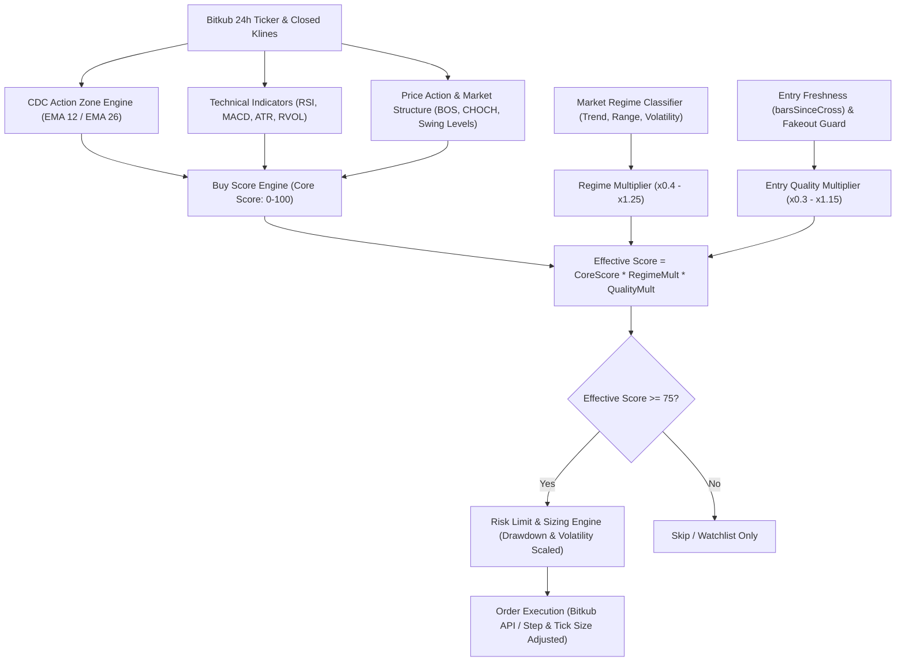

# เอกสารทบทวนตรรกะการเทรดและแบบจำลองทางคณิตศาสตร์ (Quantitative & Trading Strategy Audit)
**CDC Action Zone Trading Bot V2 (Bitkub Exchange)**
*จัดทำขึ้นเพื่อให้ AI Quantitative Strategist และ Trading Algorithm Auditor ตรวจสอบและยกระดับอัลกอริทึม*

---

## 1. บทนำและวัตถุประสงค์ (Executive Summary & Mission Objective)

เอกสารฉบับนี้รวบรวม **ตรรกะการเทรด (Trading Logic)**, **แบบจำลองทางคณิตศาสตร์ (Mathematical Formulations)**, และ **สถาปัตยกรรมการบริหารความเสี่ยง (Risk Management Framework)** ของระบบ CDC Bitkub Bot V2 จากโค้ดจริงในปัจจุบัน เพื่อเปิดทางให้ AI Agent หรือ Quantitative Engineer นำไปวิเคราะห์ เจาะลึกจุดบกพร่องทางสถิติ และเสนอแนวทางปรับปรุงโมเดลให้สามารถ **ทำกำไรได้อย่างสม่ำเสมอในทุกสภาวะตลาด (All-Weather Alpha Generation)**

### เป้าหมายหลักในการพัฒนาต่อยอด (Key Objectives):
1. **Dual-Horizon Profitability:** รองรับทั้งการเล่นสั้น (Scalping / Swing Trading ใน Timeframe 5m-1h) และการเล่นยาว (Trend Following / Position Trading ใน Timeframe 4h-1d)
2. **Advanced Market Volume & Flow:** ยกระดับการวิเคราะห์วอลุ่มจากค่าเฉลี่ยธรรมดา สู่ปริมาณการซื้อขายเชิงลึก (Volume Profile, VWAP, RVOL, Volume Delta)
3. **Robust Trend & Regime Identification:** ระบุทิศทางแนวโน้มขาขึ้น-ขาลงที่แม่นยำ พร้อมคัดกรองสัญญาณหลอก (Whipsaw / Fakeout Filter) และแยกแยะสภาวะตลาด (Market Regimes)
4. **Crypto-Specific Dynamics:** ปรับอัลกอริทึมให้สอดรับกับพฤติกรรมตลาดคริปโต เช่น ความผันผวนสูง (Fat-tailed Volatility), อิทธิพลของ Bitcoin (BTC Dominance), และสภาพคล่องใน Bitkub Spot (THB Pairs)

---

## 2. โครงสร้างตรรกะและแบบจำลองคณิตศาสตร์ในปัจจุบัน (Current Mathematical Baseline)

ระบบปัจจุบันถูกพัฒนาขึ้นบน 2 เสาหลักในโฟลเดอร์ `src/lib/`:
- [`src/lib/cdcIndicator.ts`](file:///d:/CDCBot/cdcbitkub_V2/src/lib/cdcIndicator.ts): ตัวบ่งชี้แกนหลัก CDC Action Zone (EMA 12/26)
- [`src/lib/quantEngine.ts`](file:///d:/CDCBot/cdcbitkub_V2/src/lib/quantEngine.ts): เครื่องยนต์คำนวณคะแนนเชิงปริมาณ (100-Point Buy Score Engine) และเครื่องยนต์ความเสี่ยง

---

### 2.1 สถิติและสูตรทางคณิตศาสตร์ของ Indicator ปัจจุบัน

#### 1. CDC Action Zone (EMA 12 / 26)
คำนวณ Exponential Moving Average ตามมาตรฐาน:
$$\alpha = \frac{2}{N + 1}$$
$$\text{EMA}_t = \text{Close}_t \times \alpha + \text{EMA}_{t-1} \times (1 - \alpha)$$
โดยที่ Seed Bar แรกใช้ Simple Moving Average ($\text{SMA}_N$)

* **การจำแนกสถานะ 6 สี (Action Zone Color States):**
  * **เขียว (Green):** $\text{EMA}_{12} > \text{EMA}_{26}$ และ $\text{Close} \ge \text{EMA}_{12}$ (Bullish Trend เต็มตัว)
  * **น้ำเงิน (Blue):** $\text{EMA}_{12} > \text{EMA}_{26}$ แต่ $\text{Close} < \text{EMA}_{12}$ (เตรียมพร้อมซื้อ / เริ่มต้น Golden Cross)
  * **แดง (Red):** $\text{EMA}_{12} < \text{EMA}_{26}$ และ $\text{Close} \le \text{EMA}_{12}$ (Bearish Trend เต็มตัว / จุดตัดขาดทุน)
  * **เหลือง (Yellow):** $\text{EMA}_{12} < \text{EMA}_{26}$ แต่ $\text{Close} > \text{EMA}_{12}$ (เตือนขาย / เริ่มต้น Death Cross)
  * **ส้ม (Orange):** $\text{Close} < \text{EMA}_{12} < \text{EMA}_{26}$ (ขาลงต่อเนื่องรุนแรง)
  * **ฟ้า (Cyan):** $\text{Close} > \text{EMA}_{12} > \text{EMA}_{26}$ (ขาขึ้นรุนแรง)

#### 2. Relative Strength Index (Wilder's RSI 14)
ใช้วิธีเกลี่ยแบบ Wilder's Smoothing:
$$\text{AvgGain}_t = \frac{\text{AvgGain}_{t-1} \times 13 + \text{Gain}_t}{14}, \quad \text{AvgLoss}_t = \frac{\text{AvgLoss}_{t-1} \times 13 + \text{Loss}_t}{14}$$
$$\text{RS} = \frac{\text{AvgGain}}{\text{AvgLoss}}, \quad \text{RSI} = 100 - \frac{100}{1 + \text{RS}}$$

#### 3. Moving Average Convergence Divergence (MACD 12, 26, 9)
$$\text{MACD Line} = \text{EMA}_{12}(\text{Close}) - \text{EMA}_{26}(\text{Close})$$
$$\text{Signal Line} = \text{EMA}_9(\text{MACD Line})$$
$$\text{Histogram} = \text{MACD Line} - \text{Signal Line}$$

#### 4. Average True Range (ATR 14)
$$\text{TR}_t = \max\Big(\text{High}_t - \text{Low}_t, \; |\text{High}_t - \text{Close}_{t-1}|, \; |\text{Low}_t - \text{Close}_{t-1}|\Big)$$
$$\text{ATR}_t = \frac{\text{ATR}_{t-1} \times 13 + \text{TR}_t}{14}$$

#### 5. Relative Volume (RVOL 20)
$$\text{SMA\_Vol}_{20, t} = \frac{1}{20}\sum_{i=0}^{19} \text{Volume}_{t-i}$$
$$\text{RVOL}_t = \frac{\text{Volume}_t}{\text{SMA\_Vol}_{20, t}}$$

---

### 2.2 โครงสร้างแบบจำลองคะแนนคุณภาพ (100-Point BUY Score Engine)

คะแนนแกนหลัก 100 คะแนนแบ่งตามมิติต่างๆ ใน [`calculateBuyScoreEngine`](file:///d:/CDCBot/cdcbitkub_V2/src/lib/quantEngine.ts#L479):

| มิติการประเมิน (Factor) | น้ำหนักสูงสุด | เกณฑ์ทางคณิตศาสตร์ที่ใช้ตัดสิน |
| :--- | :---: | :--- |
| **1. MACD Divergence** | **20** | Regular Bullish Divergence (+20), Hidden Bullish (+16), MACD > Signal & Hist > 0 (+14), Bearish Divergence (+2) |
| **2. Market Structure** | **20** | มีทั้ง BOS + CHOCH (+20), BOS เดียว (+16), CHOCH เดียว (+13), Blue/Green Zone (+10), อื่นๆ (+4) |
| **3. Volume / RVOL** | **15** | $\text{RVOL} \ge 2.0$ (+15), $\text{RVOL} \ge 1.5$ (+12), $\text{RVOL} \ge 1.0$ (+9), $\text{RVOL} \ge 0.7$ (+6), $< 0.7$ (+3) |
| **4. EMA 12/26 Alignment** | **10** | $\text{EMA}_{12} > \text{EMA}_{26} \land \text{Close} \ge \text{EMA}_{12}$ (+10), $\text{EMA}_{12} > \text{EMA}_{26}$ (+7), หลุดแนว (+1) |
| **5. EMA 99 Baseline** | **10** | $\text{Close} \ge \text{EMA}_{99} \land \text{EMA}_{12} > \text{EMA}_{99}$ (+10), ใกล้แนวรับ EMA 99 ภายใน 1.5% (+5), หลุด EMA 99 (+1) |
| **6. Breakout Setup** | **10** | Breakout ยืนยัน (+10), จ่อแนวต้านในกรอบ 1.5% (+7), Fakeout (0) |
| **7. RSI Momentum** | **10** | Sweet Spot $50 \le \text{RSI} \le 65$ (+10), $40-50$ หรือ $65-70$ (+7), โซน Overbought/Oversold จัด (+2) |
| **8. Anti-Fakeout (Upper Wick)**| **5** | สัดส่วนไส้บน $\frac{\text{High} - \max(\text{Open},\text{Close})}{\text{High} - \text{Low}} \le 0.45$ (+5), ไส้ยาวเกิน 45% โดนหักเหลือ (+1) |
| **รวมคะแนนฐาน (Base Score)** | **100** | **ผลรวมคะแนนดิบ 8 ปัจจัย** |

#### การปรับด้วยตัวคูณสภาวะตลาด (Regime Multipliers):
$$\text{Effective Score} = \text{Clamp}_{0-100}\Big(\text{Base Score} \times \text{Regime Factor} \times \text{Entry Quality Factor}\Big)$$

* **Regime Factor:**
  * `BULLISH_TRENDING` ($\text{EMA}_{12} > \text{EMA}_{26} > \text{EMA}_{50} \land \text{Close} \ge \text{EMA}_{12}$): $\mathbf{\times 1.25}$
  * `RANGING` (เส้น EMA พันกัน หรือสเปรดแคบ): $\mathbf{\times 0.95}$
  * `HIGH_VOLATILITY` ($\frac{\text{ATR}_{14}}{\text{Close}} > 6.0\%$): $\mathbf{\times 0.75}$
  * `BEARISH_TRENDING` ($\text{EMA}_{12} < \text{EMA}_{26} < \text{EMA}_{50} \land \text{Close} \le \text{EMA}_{12}$): $\mathbf{\times 0.40}$
* **Entry Quality Factor:**
  * เข้าไม้สดใหม่ ($\text{barsSinceCross} \le 1$): $\mathbf{\times 1.05}$
  * เข้าไม้ปกติ ($\text{barsSinceCross} \le 3$): $\mathbf{\times 0.95}$
  * เข้าไม้ช้า/ปลายเทรนด์ ($\text{barsSinceCross} > 5$): $\mathbf{\times 0.65}$
  * Bull Trap / Fakeout: $\mathbf{\times 0.30}$
  * Breakout Expansion: $\mathbf{\times 1.15}$

---

### 2.3 ตรรกะการบริหารความเสี่ยงและการออกออเดอร์ (Risk & Execution Engine)

1. **Stop Loss คำนวณด้วย Volatility (ATR-based SL):**
   $$\text{Stop Loss Price} = \text{Entry Price} - 2.0 \times \text{ATR}_{14}$$
2. **Trailing Stop แบบ High-Watermark Ratchet:**
   เมื่อราคาขึ้นทำจุดสูงสุดใหม่ ($P_{\max}$):
   $$\text{Trailing Stop Price} = P_{\max} - 2.0 \times \text{ATR}_{14}$$
   *จุด Stop มีแต่ขยับขึ้น ไม่มีการเลื่อนลงเพื่อล็อคกำไร*
3. **Dynamic Position Sizing & Drawdown Throttling:**
   * สัดส่วนไม้เท่ากัน (Equal Weighting): $\text{Size} = \frac{\text{Total Equity}}{\text{Max Open Positions}}$
   * Drawdown $\ge 5\%$: ลดขนาดไม้เหลือ 75%
   * Drawdown $\ge 10\%$: ลดขนาดไม้เหลือ 50%
   * Drawdown $\ge 15\%$: สั่ง **Halt** หยุดเปิดไม้ใหม่ทันที (Fail-Closed)
   * ขาดทุนติดกัน 3 ไม้: สั่งหยุดพัก 24 ชั่วโมง

---

## 3. การวิเคราะห์จุดบอดและช่องว่างทางคณิตศาสตร์ (Quant Gap Analysis)

เพื่อให้ Agent ผู้ตรวจประเมินเห็นภาพชัดเจน นี่คือข้อจำกัดของโมเดลปัจจุบันที่ส่งผลต่อกำไรขาดทุน:

### 3.1 จุดบอดในการเล่นสั้น (Short-term / Scalping / 5m-15m Execution)
1. **EMA Lagging Effect:** EMA 12/26 เป็นตัวบ่งชี้แบบเกาะแนวโน้ม (Trend-Following) ใน Timeframe สั้น (เช่น 5m หรือ 15m) ราคาคริปโตมักแกว่งตัวแรงในกรอบ เมื่อเกิด Golden Cross ราคามักจะขึ้นไปถึงแนวต้านแล้ว ทำให้บอทเข้าซื้อที่จุดยอด (Buy the top) แล้วโดน Stop Loss บ่อยครั้ง
2. **Stop Loss 2x ATR กว้างเกินไปสำหรับ Scalping:** การตั้งระยะตัดขาดทุน $2.0 \times \text{ATR}$ บนกราฟสั้นทำให้ Risk-to-Reward (R:R) ต่ำกว่า 1:1.5 หากตลาดไม่ได้วิ่งเป็นเทรนด์ยาว
3. **ขาด Microstructure & Order Flow Signals:** บอทยังไม่มีการคำนวณ Bid-Ask Spread, Depth Imbalance, หรือ Volume Delta ระหว่างฝั่งเสนอซื้อกับเสนอขายใน orderbook ของ Bitkub

### 3.2 จุดบอดในการเล่นยาว (Long-term / Trend Following / 4h-1d Horizon)
1. **Single-Timeframe Isolation:** บอทสแกนเหรียญบน Timeframe เดียวที่กำหนดใน BotConfig (เช่น 1h) โดย **ไม่มีการตรวจ Higher Timeframe Confluence** หาก Timeframe 1h เกิดสัญญาณซื้อ แต่ Timeframe 1D กำลังเป็นแนวโน้มขาลงอย่างหนัก ไม้นั้นจะมีโอกาสล้มเหลวสูงมาก
2. **การออกจากไม้เร็วเกินไปในเทรนด์ใหญ่:** Trailing Stop ที่ระยะ $2.0 \times \text{ATR}$ มักจะโดนสะบัดหลุด (Shakeout) ในจังหวะที่เหรียญคริปโตย่อตัวตามธรรมชาติก่อนพุ่งต่อในรอบใหญ่

### 3.3 จุดบอดด้านการวิเคราะห์วอลุ่มและสภาพคล่อง (Volume & Liquidity)
1. **Simple 20-period Volume Average:** ตัววัด $\text{RVOL} = \frac{\text{Vol}}{\text{SMA\_Vol}_{20}}$ ไม่สะท้อนเวลาของวัน (Time-of-day Volume Curve) ในตลาดคริปโตช่วงเวลา 19:00 - 24:00 UTC มักมีวอลุ่มสูงกว่าช่วงเช้า การเทียบกับค่าเฉลี่ย 20 แท่งตรงๆ อาจสร้าง False RVOL ได้
2. **ขาด Volume Profile & Value Area:** ไม่มีการคำนวณ Volume-at-Price (POC - Point of Control, VAH, VAL) ทำให้บอทไม่รู้ว่าจุดเข้าซื้ออยู่บริเวณแนวรับที่มีการสะสมวอลุ่มจริงหรือไม่ หรือเป็นการซื้อในจุดที่มีแต่ความว่างเปล่า (Low Volume Node)
3. **Bitkub Altcoin Liquidity Trap:** หลายเหรียญในกระดาน Bitkub มีสภาพคล่องต่ำในบางช่วงเวลา การสแกนเจอคะแนนสูงแต่ปริมาณเงินใน Orderbook บาง จะทำให้เกิด Slippage มหาศาลเมื่อส่งคำสั่ง Market Buy

### 3.4 จุดบอดด้านการตรวจจับเทรนด์ตลาดคริปโต (Market Regime & Macro Trends)
1. **Bitcoin Correlation Ignorance:** บอทวิเคราะห์เหรียญแต่ละเหรียญแบบแยกอิสระ (Independent Coin Analysis) โดยไม่ได้นำแนวโน้มของเหรียญแม่คือ **BTC_THB** มาเป็นตัวถ่วงน้ำหนัก ทั้งที่ในความเป็นจริง 90% ของ Altcoins จะร่วงลงทันทีเมื่อ BTC หลุดแนวรับสำคัญ
2. **Discrete vs. Probabilistic Regime:** ฟังก์ชัน `detectMarketRegime()` ในปัจจุบันใช้เงื่อนไขแบบ If-Else แข็งทื่อ (Discrete Heuristic) ขาดความต่อเนื่องเชิงความน่าจะเป็น (Probabilistic Confidence)

---

## 4. แผนผังแนวทางอัปเกรดเพื่อทำกำไร (Proposed Enhancement Matrix)

| มิติการปรับปรุง | ตรรกะปัจจุบัน (Current) | แนวทางอัปเกรดที่แนะนำ (Proposed Upgrades) | ผลลัพธ์ที่คาดหวัง |
| :--- | :--- | :--- | :--- |
| **เล่นสั้น (Scalp/Swing)** | EMA 12/26 + ATR 2x | เพิ่ม **VWAP Bands**, **Bollinger %B Mean Reversion**, และ **Tight ATR (1.0x-1.2x)** | เข้าไว ออกไว ไม่ติดยอด ได้กำไรในกรอบ Sideway |
| **เล่นยาว (Trend Rider)** | สัญญาณ 1 Timeframe | เพิ่ม **Multi-Timeframe Matrix (MTF)**: กรองเทรนด์ 1D/4h ก่อนเข้าซื้อใน 1h/15m | อัตรา Win Rate สูงขึ้น ไม่สวนเทรนด์ใหญ่ |
| **วอลุ่ม (Volume)** | RVOL เทียบกับ SMA 20 | เพิ่ม **On-Balance Volume (OBV) Divergence**, **Volume Profile POC**, และ **Volume Delta** | ตรวจจับการสะสมของวาฬ (Smart Money Accumulation) |
| **แนวโน้มคริปโต (Trend)** | EMA 12/26/50 บนเหรียญเดี่ยว | เพิ่ม **BTC Market Beta Filter** และ **Crypto Market Regime Index** | หยุดเปิด Long ใน Altcoin ทันทีที่ BTC กำลังเทกระจาด |
| **การทำกำไร (Exit)** | Trailing Stop คงที่ | **Partial Take Profit (Scaling Out)**: แบ่งปิด 50% ที่ 1.5R และรันเทรนด์อีก 50% ด้วย Chandelier Exit | ล็อคกำไรเข้ากระเป๋าก่อน ไม่ปล่อยให้กำไรกลายเป็นขาดทุน |

---

## 5. คำถามนำทางสำหรับ AI Agent ในการรีวิวและปรับปรุง (Auditor Guiding Questions)

โปรดใช้หัวข้อคำถามต่อไปนี้ในการสแกนและออกแบบโมเดลคณิตศาสตร์ตัวใหม่:

### คำถามที่ 1: การออกแบบ Multi-Timeframe Confirmation Matrix (MTF)
* *ปัญหา:* ใน [`server.ts`](file:///d:/CDCBot/cdcbitkub_V2/server.ts) ฟังก์ชัน `runServerBotCycle` ปัจจุบันดึงแท่งเทียนเฉพาะ `config.timeframe` เท่านั้น
* *คำถาม:* ควรออกแบบฟังก์ชัน `fetchMultiTimeframeKlines()` อย่างไรให้ดึง Higher Timeframe (เช่น สแกนหาจุดเข้าที่ 15m แต่ตรวจเทรนด์ 4h และ 1d) โดยไม่ทำให้ติด Rate Limit ของ Bitkub API?
* *โจทย์คณิตศาสตร์:* น้ำหนักคะแนน (Weight) ควรแบ่งระหว่าง Higher Timeframe Trend Bias (เช่น 40%) กับ Lower Timeframe Trigger Execution (เช่น 60%) อย่างไรเพื่อลด Drawdown?

### คำถามที่ 2: การพัฒนาตัวชี้วัด Volume & Liquidity สำหรับ Bitkub Spot
* *ปัญหา:* ตลาด Bitkub มีทั้งเหรียญสภาพคล่องสูง (BTC, ETH, USDT) และเหรียญสภาพคล่องต่ำ
* *คำถาม:* จะปรับปรุงสูตรคำนวณ RVOL อย่างไรให้ตัดผลกระทบของ Volume Spike ผิดปกติ (Wash trading หรือ ปั๊มชั่วขณะ)?
* *โจทย์คณิตศาสตร์:* ควรนำสูตร VWAP (Volume Weighted Average Price):
  $$\text{VWAP} = \frac{\sum (P_i \times V_i)}{\sum V_i}$$
  มาใช้เป็น Dynamic Support/Resistance ร่วมกับ CDC Action Zone ในการคัดกรองจุดเข้าซื้ออย่างไร?

### คำถามที่ 3: Dynamic Adaptive Stop Loss & Partial Profit Taking
* *ปัญหา:* โค้ดปัจจุบันขายทิ้งทั้งก้อน 100% เมื่อโดน Stop Loss หรือสัญญาณขายสีแดง ทำให้กำไรบางรอบที่ขึ้นไปสูงแล้ว วนกลับมาปิดเสมอตัว
* *คำถาม:* ใน [`server.ts`](file:///d:/CDCBot/cdcbitkub_V2/server.ts) ควรปรับโครงสร้าง `PaperPosition` และ `ExecutedTrade` อย่างไรให้รองรับ **Partial Sell (เช่น ขาย 50% แรกเมื่อราคาถึง TP1 ที่ +2R และเลื่อน Stop Loss ของส่วนที่เหลือมาที่จุด Break-even)**?
* *โจทย์คณิตศาสตร์:* สูตรคำนวณ Chandelier Exit หรือ Supertrend Trailing Stop:
  $$\text{Stop} = \text{HighestHigh}(N) - K \times \text{ATR}(N)$$
  เหมาะสมกว่าค่าคงที่ $2.0 \times \text{ATR}$ หรือไม่? ค่า $K$ ควรแปรผันตาม Market Regime อย่างไร?

### คำถามที่ 4: การคัดกรองความสัมพันธ์กับ Bitcoin (BTC Macro Shield)
* *ปัญหา:* Altcoin ใน Bitkub มี Correlation กับ BTC สูงกว่า 0.8 ในช่วงตลาดปรับฐาน
* *คำถาม:* ควรสร้างฟังก์ชัน `getBtcMarketRegime()` ใน Server ให้สแกน BTC_THB ก่อนทุกๆ รอบ หาก BTC อยู่ในสถานะ `BEARISH_TRENDING` หรือมี RSI < 40 ให้ลดขนาด Position Size ของเหรียญอื่นลงอัตโนมัติ 50-70% ดีหรือไม่?

---

## 6. ข้อกำหนดการทดสอบเชิงปริมาณ (Quantitative Validation Protocol)

เมื่อ Agent ใดนำเสนอตรรกะหรือสูตรคณิตศาสตร์ใหม่ จะต้องผ่านเกณฑ์การทดสอบต่อไปนี้ก่อนอนุมัติเข้า Main Codebase:

1. **Anti-Lookahead Bias Verification:**
   * ต้องไม่มีการนำข้อมูลแท่งเทียนที่ยังไม่ปิด (`unclosed bar`) มาคำนวณ (ต้องผ่าน `getClosedCandles()` ตาม Section 02 เสมอ)
2. **Backtest Benchmark Comparison:**
   * ต้องทดสอบเทียบกับผลการทดสอบเดิมบนคู่เหรียญหลัก (BTC, ETH, SOL) ย้อนหลังอย่างน้อย 180 วัน
   * **Sharpe Ratio** ต้องมากกว่า $\ge 1.5$
   * **Profit Factor** ต้องมากกว่า $\ge 1.75$
   * **Maximum Drawdown (MDD)** ต้องไม่เกิน $\le 15\%$
3. **Execution Feasibility on Bitkub:**
   * สูตรที่คำนวณได้ต้องสอดคล้องกับ Bitkub Step Size และ Min Notional (ไม่ส่งออเดอร์ทศนิยมเกินจริง หรือต่ำกว่าเกณฑ์ขั้นต่ำ)
4. **TypeScript & Unit Test Passing:**
   * ต้องรัน `npx tsc --noEmit` ผ่าน 0 errors
   * ต้องเขียน Unit Tests ใน `src/lib/__tests__/` ครอบคลุม Edge Cases ทั้งหมด และรัน `npm test` ผ่าน 100%

---

*เอกสารฉบับนี้พร้อมส่งมอบให้ AI Quantitative Analyst, Trading Strategy Optimizer, หรือวิศวกรซอฟต์แวร์นำไปศึกษาและเริ่มดำเนินการปรับปรุงตรรกะในขั้นตอนต่อไปได้ทันที*
## 7. ข้อจำกัดของ Backtest (ตรวจทานแก้ไข 2026-09-27)

ข้อความสถานะก่อนหน้านี้ที่ระบุว่า Backtest เรียก Quant Engine และมี MTF/BTC filters ไม่ตรงกับ implementation จริง จึงยกเลิกข้ออ้างดังกล่าวไว้ในฉบับนี้ ปัจจุบัน Backtest จำลองเฉพาะ CDC Action Zone ตามตัวเลือกโซนซื้อ และไม่ได้ใช้คะแนน Quant, MTF หรือ BTC Macro Shield

- สัญญาณ CDC ประเมินจากแท่งที่ปิดแล้ว; คำสั่งจำลองเข้า/ออกจาก CDC ใช้ราคาเปิดแท่งถัดไป
- Stop Loss/Take Profit ตรวจจาก OHLC, รองรับ gap ที่ราคาเปิด และเมื่อชน stop กับ target ในแท่งเดียวกันจะเลือก stop ก่อน (สมมติฐานแบบอนุรักษ์นิยม)
- ค่าคอมมิชชัน, ค่าบริการอื่น และ slippage ต่อด้านปรับได้; คิด VAT 7% บนค่าคอมมิชชัน/ค่าบริการแยกต่างหาก ค่าเริ่มต้นยังเป็นสมมติฐาน ไม่ใช่เรตจริงของบัญชี/โบรกเกอร์
- จำลองเฉพาะ Long; ใช้ board lot 100 หุ้นเป็นค่าเริ่มต้น และประเมิน 50 หุ้นจากราคาปิดย้อนหลัง 6 เดือนเฉพาะเมื่อข้อมูล daily ครบตาม heuristic ทั้งนี้ SET ประกาศวันมีผลล่วงหน้า จึงยังไม่แทนประวัติ master/effective-date ของแต่ละหลักทรัพย์
- Mark-to-market ของ equity curve หักค่าใช้จ่ายสมมติในการปิดสถานะแล้ว; turnover เป็นมูลค่าซื้อ+ขายเทียบ equity เฉลี่ย และ ADV20/ขนาดคำสั่งเป็น liquidity proxy เท่านั้น ไม่จำลอง market impact, คิวคำสั่ง, corporate actions หรือ delisted/suspended survivorship

ผลทดสอบเหล่านี้ตรวจความถูกต้องเชิงโค้ดและสมมติฐาน ไม่ใช่หลักฐานว่ากลยุทธ์ทำกำไรได้ ต้องทำ out-of-sample/walk-forward โดยใช้ต้นทุนและข้อมูลที่เหมาะกับตลาดไทยก่อนพิจารณาใช้งานจริง

## 8. แนวทางใช้งานกับหุ้นไทย: CDC 1D และตำแหน่งราคาในรอบ (2026-09-27)

กลยุทธ์หลักของระบบหุ้นไทยยังยึด **CDC Action Zone V3 บนกราฟ 1D** และประเมินสัญญาณจากแท่งวันที่ปิดแล้ว การแบ่งตำแหน่งราคาเป็นข้อมูลเสริมให้ผู้ใช้เปิดดู/กรองตามต้องการ ไม่ได้แทนสัญญาณ CDC ไม่เปลี่ยนคะแนน และไม่ควรใช้เป็นเหตุผลซื้อหุ้นที่แนวโน้มเสีย

### 8.1 การแบ่ง 3 โซนจากกรอบ 60 วัน

คำนวณจากราคาปิดล่าสุดของแท่งวันที่ปิดแล้ว, ATR(14), **swing low ล่าสุดที่ยืนยันด้วยแท่งซ้าย/ขวาอย่างละ 2 แท่ง** และ High สูงสุดของ **60 sessions ก่อนหน้า** (ไม่รวมแท่งล่าสุด เพื่อไม่ให้แท่งที่เพิ่งทำ Low กำหนดฐานของตัวเอง):

- `NEAR_BASE` / ใกล้ฐาน: ราคาห่าง Low ก่อนหน้าไม่เกิน 2 ATR หรืออยู่ใน 35% ล่างของกรอบ 60 วัน
- `MID_RANGE` / โซนกลาง: อยู่ระหว่างเขตใกล้ฐานและเขตยืดตัว
- `EXTENDED` / ราคายืดตัว: ห่างฐานอย่างน้อย 4 ATR หรืออยู่ใน 25% บนของกรอบ 60 วัน (คง guard กันไล่ราคาเดิม)

การอยู่โซนใกล้ฐานจะขึ้นสถานะ `entryReady` ต่อเมื่อราคายังยืนเหนือฐานและ EMA26, CDC เป็น GREEN และ Golden Cross ยังอยู่ในช่วง 2 แท่งแรก หากยังไม่ผ่าน ให้แสดงเป็น “รอ CDC ยืนยัน” และไม่ถือเป็นสัญญาณซื้อ หากราคาปิดต่ำกว่า swing low จะแสดง “หลุดฐาน”

### 8.2 คะแนนและหน้าจอตัดสินใจ

- `qualityScore` ยังคงใช้ 5 ปัจจัยเดิม (Golden Cross, CDC zone, trend strength, turnover 24h, price change 24h) แต่ปรับน้ำหนักเชิงพฤติกรรมให้สอดคล้องกับเขียวซื้อ/แดงขายและเลี่ยงการไล่ราคา (รายละเอียดใน 8.3)
- การจัดอันดับและคะแนน CDC ไม่เปลี่ยนตามตำแหน่งราคา
- Scanner ใช้ CDC 1D เท่านั้นและตัดแท่งวันที่ยังไม่ปิดก่อนประเมินโซน/สัญญาณ ส่วนองค์ประกอบที่มาจาก ticker และใช้ในคะแนนเดิมยังคงตาม logic เดิม
- ปุ่ม `ดูตำแหน่งราคา` ใน Scanner เปิด/ปิดข้อมูลและตัวกรอง 3 โซน (ค่าเริ่มต้นปิด) โดยไม่เปลี่ยนคะแนน CDC หรือการเรียงตามคะแนน
- ปุ่ม `ฐาน / โซน` บนกราฟเปิด/ปิดเส้นฐานและ High 60 วัน พร้อมระยะห่างฐานในหน่วย ATR; ใช้ได้เฉพาะกราฟ 1D และค่าเริ่มต้นปิด
- ป้ายใกล้ฐานเป็นข้อมูลเสริม/ตัวกรองที่ผู้ใช้เลือกเปิดเอง การเข้าซื้อยังต้องรอสัญญาณ CDC 1D ตามกติกาเดิม และต้องประเมิน stop/position size แยกต่างหาก

ค่า 2 ATR/35% สำหรับใกล้ฐานและ 4 ATR/25% สำหรับยืดตัวเป็น heuristic ไม่ใช่ค่าที่พิสูจน์ผลตอบแทนแล้ว ควรทดสอบ walk-forward กับหุ้นหลายกลุ่ม รวมค่าธรรมเนียม, slippage, หุ้นที่ถูกพักการซื้อขาย/สภาพคล่องต่ำ และ corporate actions ก่อนใช้เป็นคำแนะนำอัตโนมัติ

### 8.3 กติกาเข้าซื้อและแนวทางคะแนน (ปรับ 2026-09-28)

- ค่าเริ่มต้นของ Bot และ Backtest เปลี่ยนเป็นซื้อเมื่อ CDC ยืนยัน `GREEN` เท่านั้น โดยต้องเป็นแท่งเขียวแรกหลัง BLUE/YELLOW/RED และ Golden Cross ยังสดไม่เกิน 2 แท่ง; `BLUE` เป็นสัญญาณเตือนก่อนเข้า ไม่ใช่จุดซื้อของค่าเริ่มต้น ผู้ใช้ยังเลือกโหมด BLUE แบบเชิงรุกได้เอง
- ค่าเริ่มต้นออกจากสถานะตาม `RED` เท่านั้น; `YELLOW` เป็นคำเตือน/ตัวเลือกให้ออกจากสถานะก่อนกำหนด ไม่ใช่กติกาขายปริยาย
- Bot ยังมี Quant gate แยกจาก 5-factor Scanner Score (RSI/RVOL/VWAP/ATR และ market regime; ค่าเริ่มต้น min score 80) ซึ่งให้ factor สูงกับ GREEN สดและลด factor ของ BLUE/โซนอื่น จึงอาจงดซื้อแม้มีแท่งเขียวสด หากคะแนนรวมยังไม่ถึงเกณฑ์
- คะแนนความสดของ Golden Cross ให้เต็ม 35 เมื่อสัญญาณอยู่ใน GREEN; หากเป็น BLUE/สีอื่นจะถูกลดแต้มและระบุให้รอเขียวยืนยัน ส่วน RED ถูกจัดเป็น `BEAR_AVOID` และไม่ให้คะแนนด้านความสด, โซน, หรือโมเมนตัมราคา
- คะแนน CDC zone สูงสุด 25 สำหรับ GREEN สด, 22 สำหรับ GREEN ในช่วงต้นรอบ, 16 สำหรับ GREEN ที่ดำเนินต่อ; BLUE ได้ 8 เพื่อคงสถานะ pre-signal
- คะแนน Trend (0–20) และมูลค่าซื้อขาย 24 ชั่วโมง (0–10) ยังคงใช้เกณฑ์เดิม โดย turnover เป็นมูลค่าเงินบาท
- คะแนนราคาเปลี่ยนแปลง 24 ชั่วโมง (0–10) เปลี่ยนเป็นเน้นการเคลื่อนไหวต้นรอบ: ช่วง -0.5% ถึง +0.5% ได้ 9, +0.5% ถึง +2% ได้ 10, และลดแต้มเมื่อขึ้นเกิน +2% (มากกว่า +7% ได้ 2) เพื่อไม่ให้หุ้นที่พุ่งแรงกลายเป็นอันดับซื้อสูงเพียงเพราะโมเมนตัม
- ปุ่มแบ่งโซนราคาและตัวกรอง Near Base ยังคงเป็นข้อมูลเสริม ไม่เพิ่ม/หักคะแนนหลักโดยอัตโนมัติ และไม่สามารถแทนการยืนยัน GREEN + Golden Cross สดได้
- Backtest ใช้สัญญาณ CDC ที่แท่งปิดและซื้อ/ขายที่ราคาเปิดแท่งถัดไป; ใช้กติกา GREEN สด/RED ขายตามค่าเริ่มต้น แต่ยังไม่รวม Quality Score, ตัวกรอง Near Base, MTF หรือ BTC Macro Shield จึงยังไม่พิสูจน์ผลกำไรของกลยุทธ์ครบชุด

## 9. การดำเนินการตาม Step 2–7 (2026-09-27)

- **Step 2 — แหล่งข้อมูลตลาด/โบรกเกอร์:** ปิดการสร้าง Order Book ปลอม และเปลี่ยน endpoint depth/balances/order เป็น HTTP 501 จนกว่าจะมี adapter ที่เชื่อมต่อและยืนยันข้อมูลจริง
- **Step 3 — Live/Paper:** ปิด Live mode และคำสั่ง Live ที่ยังไม่มี adapter; คำสั่ง manual ที่พบ state เป็น Live ถูกปฏิเสธ ไม่บันทึก Paper fill แทน และ trading engine fail-closed ไปทาง Paper
- **Step 4 — Backtest:** ใช้ CDC จากแท่งปิดและ next-bar-open fills, OHLC stops/targets, gap handling, stop-first ในกรณีชนกัน, ค่าคอมมิชชัน/VAT/ค่าบริการ/slippage, minimum notional แบบตั้งค่า และ board-lot proxy (รายละเอียด/ข้อจำกัดใน Section 10)
- **Step 5 — Secrets/Auth:** เอา XOR และการเก็บ broker credentials ใน browser storage ออก; เข้ารหัส broker/Telegram secrets ที่ฝั่ง server ด้วย AES-256-GCM; บังคับ `DASHBOARD_TOKEN` ใน production และไม่บันทึกเลขบัญชีใน server log
- **Step 6 — แท่งยังไม่ปิด:** normalize timestamp วินาที/มิลลิวินาที และตัด intraday/daily candles ที่ยังอยู่ระหว่างก่อตัวก่อนใช้เป็นสัญญาณ (daily ยังคงไม่ยืนยันในช่วงพักกลางวันจนถึงปิดตลาด) โดย weekly candle จะสมบูรณ์หลังปิดสัปดาห์
- **Step 7 — Risk controls:** ปรับขนาด position ตาม drawdown, latch หยุดเปิดสถานะใหม่ที่ drawdown 15%, พัก 24 ชั่วโมงหลังแพ้ติดกัน 3 ครั้ง และรองรับ partial take profit 1.5R/50% พร้อมเลื่อน stop ของส่วนที่เหลือไป breakeven (จำนวนขายปัดลงตาม board lot)

สถานะ ณ 2026-09-27: ยืนยันด้วย `bun run test` (16 tests) และ `bun run lint`; production build ยังรอการตรวจในรอบนั้น ผลผ่านดังกล่าวเป็นเพียงการตรวจ behavior ของซอฟต์แวร์ ไม่ได้รับประกันผลตอบแทน และระบบยังไม่พร้อมส่งคำสั่ง Live จนกว่าจะพัฒนา/ทดสอบ broker adapter แยกต่างหาก

## 10. Backtest Quant Audit — ต้นทุน, metrics และ validation tooling (2026-09-28)

### สูตรและสมมติฐานที่เพิ่ม

- คำสั่งซื้อ/ขายยังคงใช้สัญญาณ CDC จากแท่งปิดและ fill ที่ราคาเปิดแท่งถัดไป; slippage ถูกใส่ด้านเสียเปรียบและปัดราคาตาม tick ของ SET
- สำหรับ notional `N`, commission rate `c`, other service-fee rate `o`, VAT rate `v` (เปอร์เซ็นต์): `commission=N*c/100`, `otherFee=N*o/100`, `VAT=(commission+otherFee)*v/100`; ต้นทุนรวมฝั่งนั้นคือผลบวกสามรายการ ค่าปริยาย VAT 7% สอดคล้องกับข้อมูล SET แต่ `c/o/slippage` เป็นค่าตั้งต้นสมมติและต้องปรับตามใบยืนยันรายการของบัญชีจริง
- คำสั่งซื้อปัดลงตาม board lot; ค่าปริยาย 100 หุ้น และ heuristic จะอนุญาต 50 หุ้นเมื่อข้อมูล daily ก่อนวันซื้อครอบคลุมราว 183 วัน มีอย่างน้อย 100 closes ไม่มี gap ใหญ่ และ closes ที่พบทั้งหมดไม่น้อยกว่า ฿500 กติกา SET ระบุ 100 หุ้นทั่วไป และ 50 หุ้นเมื่อราคาปิดไม่น้อยกว่า ฿500 ต่อเนื่อง 6 เดือน โดย SET ประกาศวันเปลี่ยนล่วงหน้า ดังนั้น heuristic นี้ไม่รู้ effective date ที่ประกาศจริงและต้องถือเป็น proxy จนกว่าจะป้อนประวัติ board-lot master [กติกา Board Lot ของ SET](https://www.set.or.th/en/market/information/trading-procedure/trading-units)
- บังคับ `minNotionalThb` เพิ่มได้หลังปัด lot; ค่า 0 หมายถึงปิดตัวกรองขั้นต่ำเพิ่มเติม
- Sharpe ใช้ผลตอบแทน equity close-to-close หัก risk-free rate (ปริยาย 0%), annualize 252 periods สำหรับ 1D / 52 สำหรับ 1W; Sortino ใช้ downside deviation, Calmar = CAGR / MDD, CAGR annualize ตามเวลาปฏิทินจริง และ MDD รวมค่าปิดสถานะสมมติ
- Profit Factor = กำไรรวมของไม้บวก / ขาดทุนรวมสัมบูรณ์; แสดง unknown เมื่อไม่มีไม้ขาดทุน แทนการใส่ค่าแทน 99. Expectancy เป็น net THB ต่อไม้; Expectancy-R เป็นค่าเฉลี่ย `net PnL / initial risk` เฉพาะไม้ที่ตั้ง Stop Loss
- Turnover = notional ซื้อ+ขาย / equity เฉลี่ยของช่วงทดสอบ. ADV20 ใช้ค่าเฉลี่ย `close × volume` ของ 20 แท่ง daily ที่ปิดแล้วก่อนเข้า และรายงานขนาดคำสั่งเข้าเป็น % ADV20; นี่ไม่ใช่ market-impact/capacity model
- Monte Carlo bootstrap สุ่ม trade-level `pnlPercent` แบบใส่คืน 2,000 รอบและ compounding เพื่อแสดงโอกาสขาดทุน, P5 return และ P95 drawdown; ไม่รักษาลำดับ/การเกาะกลุ่มของ trades, holding-time, regime, เงินสดที่เหลือเพราะ board-lot rounding หรือ market impact จึงเป็น diagnostic ไม่ใช่ confidence interval ของ alpha
- `createWalkForwardFolds()` วาง expanding chronological folds ปริยาย 5 folds, train 50%, validation 10%, embargo 26 แท่ง และ test ที่เหลือเท่า ๆ กัน เป็นเพียงตัวสร้างช่วง index; ยังไม่มี workflow เลือกพารามิเตอร์/รันรายงานผล OOS อัตโนมัติ

### สถานะผลเชิงประจักษ์

- หน้า Backtest ดึง `^SET.BK` เป็นค่าเริ่มต้นและวาด equity เทียบ benchmark ที่ normalize ด้วยเงินทุนเริ่มต้น; มี TDEX/BSET100 เป็น ETF proxy ให้เลือกและปิด benchmark ได้ สัญลักษณ์ดัชนีถูกส่งผ่าน client โดยคง `^` และ URL-encode ก่อน server แปลงเป็น Yahoo ticker
- `^SET.BK` เป็น SET price index ไม่ใช่ SET TRI และไม่รวมปันผล; benchmark metrics คำนวณได้เมื่อ benchmark candles ตรงวันของ equity curve ครบเท่านั้น จึงควรใช้ SET TRI หากต้องการ total-return comparator เพราะ TRI รวม capital gain/loss, rights และ dividend ที่นำกลับลงทุน [นิยาม SET TRI](https://www.set.or.th/en/market/index/tri/profile)
- ไม่มีไฟล์ OHLCV/benchmark ที่จัดเตรียมไว้ใน repo ณ วันที่ตรวจ และหน้า backtest ปัจจุบันโหลดข้อมูลตาม provider ที่มีข้อจำกัดจำนวนแท่ง; จึง **ยังไม่ได้รัน baseline เทียบ upgraded, 5-fold OOS, regime breakdown, sensitivity, DSR หรือ White Reality Check** และไม่มีค่าผลตอบแทนใดในเอกสารนี้เป็นหลักฐานว่าชนะตลาด
- VAT 7% ถูกแยกจาก commission/service fee ตามหน้าอธิบายภาษีของ SET; อัตราค่าคอมมิชชัน/ค่าธรรมเนียมอื่นยังขึ้นกับบัญชีและโบรกเกอร์ [ภาษีและ VAT ของ SET](https://www.set.or.th/en/market/information/tax)
- Verification ล่าสุดหลังต่อ Yahoo `^SET.BK`: `bun run test` ผ่าน 36 tests, `bun run lint` ผ่าน, `bun run build` ผ่าน; มี unit/integration tests ยืนยัน caret preservation, request URL, Yahoo index route และ benchmark equity normalization. Vite ยังเตือน JS bundle ขนาดประมาณ 1.08 MB เกิน 500 KB ซึ่งเป็น warning ด้าน code-splitting ไม่ใช่ build failure

### Roadmap 3 เฟส

1. **Quick win — เสร็จบางส่วน:** เพิ่มต้นทุน VAT/ค่าบริการ, tick/lot/min-notional controls, net-liquidation equity curve, Sharpe/Sortino/Calmar/Expectancy/Turnover/ADV proxy, `^SET.BK` benchmark และ ETF proxies พร้อมกราฟเทียบ, fold planner, trade-bootstrap diagnostic และ unit tests โดยไม่เปลี่ยน CDC entry/exit/score
2. **Core alpha — ยังไม่เริ่มจนกว่าจะมีข้อมูล:** เตรียม survivorship-aware SET100/TRI/dividend/corporate-action data และต้นทุนจริง; รัน baseline ก่อน จากนั้นทดสอบทีละสมมติฐาน (GREEN+Golden Cross freshness, swing-low/ATR location, MTF, liquidity, exits/sizing) ด้วย validation และ walk-forward OOS ≥5 folds พร้อม regime, slippage/parameter sensitivity และ ablation; ห้ามนำคะแนน/indicator ใหม่เข้า live path ก่อนผลครบ
3. **Production hardening — ยังเหลือ:** ต่อ benchmark/data provenance, board-lot effective-date master, delisted/suspended/price-limit handling, market-impact/capacity, reproducible run manifests, slippage scenarios, block bootstrap/DSR หรือ White Reality Check และ independent review ก่อนอนุมัติ Paper/Live

**ข้อสรุป:** โค้ดชุดนี้เพิ่มความซื่อตรงของการจำลองและเครื่องมือวัด แต่ไม่เปลี่ยนกลยุทธ์ให้พิสูจน์ว่าทำ excess return ได้ และไม่ผ่านเกณฑ์อนุมัติ OOS ที่ระบุไว้ เพราะยังไม่มี dataset/benchmark และยังไม่ได้รันการทดสอบดังกล่าว แนะนำใช้เพื่อทดลอง/observability เท่านั้น; ยังไม่ควรใช้เป็นเหตุผลเปิดเงินจริงหรือสรุปว่ากลยุทธ์มี edge
